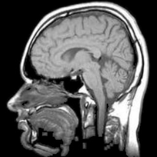
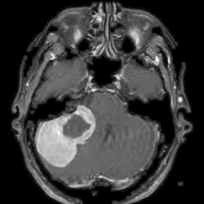
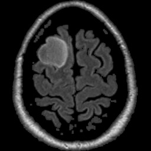
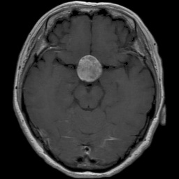

# Brain Tumor Classification with Random Forest and Supervised Learning

  
  
  

## Table of Contents
- [Overview](#overview) 📚
- [Preview](#preview) 📸
- [Purpose](#purpose) 🎯
- [How to Run 🚀](#how-to-run-) ⚙️
- [Installation](#installation) 💻
- [How the Model Works](#how-the-model-works) 🤖
- [Demo](#demo) 🎥
- [Classification Process](#classification-process) 🧠
- [Model Evaluation 📊](#model-evaluation) 📊
- [Applications](#applications) 🌐
- [Ethical Considerations](#ethical-considerations) ⚖️
- [Future Prospects](#future-prospects) 🔮
- [Contact Information](#contact-information) 📞
- [Acknowledgements](#acknowledgements) 🙏
- [Contribution](#contribution) 🤝
- [License](#license) 📝

## Overview
This project leverages **supervised learning** and a **Random Forest Classifier** to categorize brain tumor images into four distinct types. By analyzing medical imaging data, it aims to assist in **early detection**, **diagnostic support**, and **medical research**.

This project was developed as part of my Soft Computing course tasks in my 3rd year at the IT Department, FCIS, Mansoura University.

## Preview

| Sample MRI Image | Model Prediction |
|:----------------:|:----------------:|
|  | Normal |
|  | Meningioma Tumor |
|  | Glioma Tumor |
|  | Pituitary Tumor |

## Purpose
Brain tumors vary in **type, severity, and progression**, necessitating accurate classification for effective treatment. This project serves multiple objectives:
- **Automated tumor detection** using machine learning.
- **Educational aid** for researchers, students, and healthcare professionals.
- **Advancement in AI-driven medical imaging**.

## How to Run 🚀

### Prerequisites
- Windows OS (for .bat file support)
- Python 3.7+ installed 

## Installation

1. Download the repository.
2. Extract the `brain_tumor_dataset.zip` file.
3. Run the `install_requirements.bat` file as an administrator to install all required packages.
4. Open the project folder using **Visual Studio Code** (VS Code).
5. You're all set! 🎉

## How the Model Works 🤖

1. **Data Preprocessing**: 
   - Images are resized and normalized.
   - Tumor labels are encoded numerically for the classification task.
2. **Random Forest Classifier**: 
   - The model is trained on features extracted from MRI images.
   - It uses the decision tree algorithm in an ensemble approach to classify new images.
3. **Prediction**: 
   - Given a new MRI image, the model classifies the tumor into one of four categories.

## Demo 🎥
Here is a demo of how the model works and generates a Confusion Matrix:

Here is a demo of how the model predicts an image:

## Classification Process
Supervised learning enables the model to recognize patterns from labeled datasets. The workflow includes:
1. **Data Collection**: Sourcing and organizing tumor-labeled medical images.
2. **Feature Extraction**: Identifying unique imaging characteristics for classification.
3. **Prediction**: Using Random Forest to assign tumor categories based on extracted patterns.
4. **Evaluation**: Validating accuracy through established performance metrics.
5. **External Image Classification**: Enabling users to submit new images for assessment.

## Model Evaluation 📊
The model is evaluated using the following metrics:
- **Accuracy**: Measures the proportion of correct predictions.
- **Precision**: Evaluates how many of the predicted positive instances are actually positive.
- **Recall**: Measures how many of the actual positive instances were correctly identified.
- **F1 Score**: Combines precision and recall into one metric.

## Applications
- **Clinical Decision Support**: Assisting radiologists and oncologists in preliminary tumor classification.
- **Medical Research**: Advancing the understanding of tumor characteristics through AI-based analysis.
- **Educational Resource**: Helping students and professionals grasp tumor detection methodologies.

## Ethical Considerations
- **Not a substitute for medical diagnosis**—professional consultation is essential.
- **Designed for research and educational use**, not direct patient treatment.
- **Accuracy influenced by dataset quality**—interpret results cautiously.

## Future Prospects
- **Deep Learning Integration**: Enhancing feature extraction using neural networks.
- **Dataset Expansion**: Increasing variety for greater generalization.
- **Optimized Classification Models**: Refining algorithms for improved precision.

## Contact Information  
📧 **Email**: amrbedir@std.mans.edu.eg  
🏫 **Affiliation**: FCIS, Mansoura University, 3rd, IT Dept.  
👩‍🔬 **Supervised by**: Dr. Fatma Alzahraa Ahmed

## Acknowledgements 🙏
- [Kaggle Brain Tumor MRI dataset](https://www.kaggle.com/datasets/masoudnickparvar/brain-tumor-mri-dataset)
- [Random Forest Classifier documentation](https://scikit-learn.org/stable/modules/ensemble.html#random-forest)
- [Matplotlib](https://matplotlib.org/) for data visualization

## Contribution
Feel free to fork the repository, create pull requests, or open issues to contribute!

<table>
  <tr>
    <td align="center">
      <a href="https://github.com/AmrBedir">
         
        <b>Amr Bedir</b>
      </a>
       
      <a href="https://github.com/AmrBedir">GitHub</a> • <a href="https://www.linkedin.com/in/amrbedir/">LinkedIn</a>
    </td>
    <td align="center">
      <a href="https://github.com/karimbehery">
         
        <b>Karim Behery</b>
      </a>
       
      <a href="https://github.com/karimbehery">GitHub</a> • <a href="https://www.linkedin.com/in/karimbehery/">LinkedIn</a>
    </td>
    <td align="center">
      <a href="https://github.com/KareemMohamedGomaa">
         
        <b>Kareem Mohamed Gomaa</b>
      </a>
       
      <a href="https://github.com/KareemMohamedGomaa">GitHub</a> • <a href="https://www.linkedin.com/in/kareemmohamedgomaa/">LinkedIn</a>
    </td>
        <td align="center">
      <a href="https://github.com/xkarimabdelaziz">
         
        <b>Karim Abdelaziz</b>
      </a>
       
      <a href="https://github.com/xkarimabdelaziz">GitHub</a> • <a href="https://www.linkedin.com/in/xkarimabdelaziz/">LinkedIn</a>
    </td>
  </tr>
</table>

## License
This project is open-source under the **MIT License**. 
---

Made with ❤️ fueled by ☕

<b>Always seeking knowledge, always growing 🚀</b>

